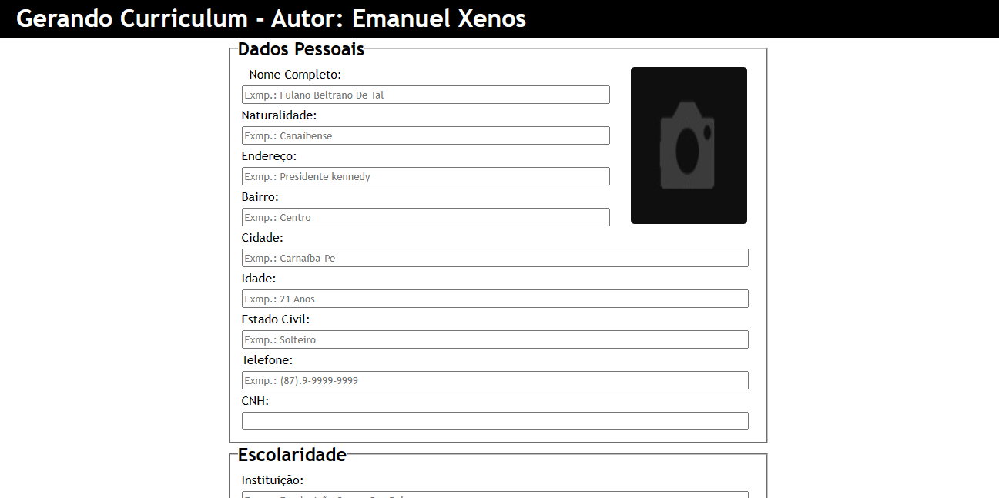

# Generador Curriculos
&nbsp;Sistema para geração de currículos, ele é bem simples, mas bastante intuítivo. Assim que você abrir, você vai notar campos de texto, com descrições indusido o usuário como utilizar o mesmo. 

## Mais sobre o sistema
&nbsp; O sistema faz jus ao nome, ele gera currículos. Os documentos são gerados com a extensão do word, sendo assim é possível fazer a edição do mesmo ao qualquer momento. Logo em seguinda,
depois que você digitar seus dados, é só ir para à ala proucurar, e pesquisar pelo nome da pessoa que escrito no primeiro campo do curriculo. Detalhe ele respeita maiúsculas e minúsculas.
Dessa forma é sempre bom deixar todos em maisúculas na hora de pesquisar. 
&nbsp; Esse sistema foi a pedido de uma assitência de informática, onde a mesma realizava sempre a criação de cv para clientes, eles já tinha um modelo lá, o mesmo foi tomando como base para criação desse sistema aqui.

## Tecnologias usadas

  <ul>
    <li>HTML5</li>
    <li>CSS3</li>
    <li>PHP</li>
    <li>Biblioteca PhpWord</li>
  </ul>

# Caputra de tela:

  

